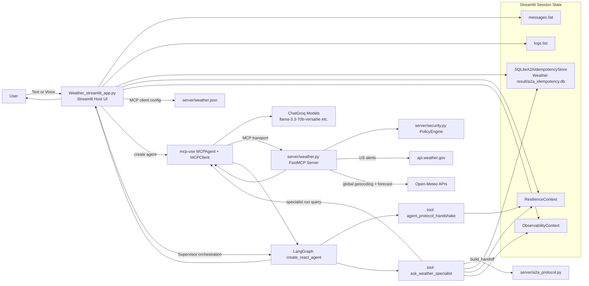
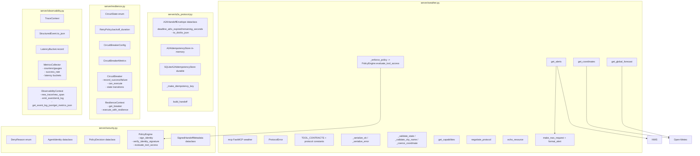
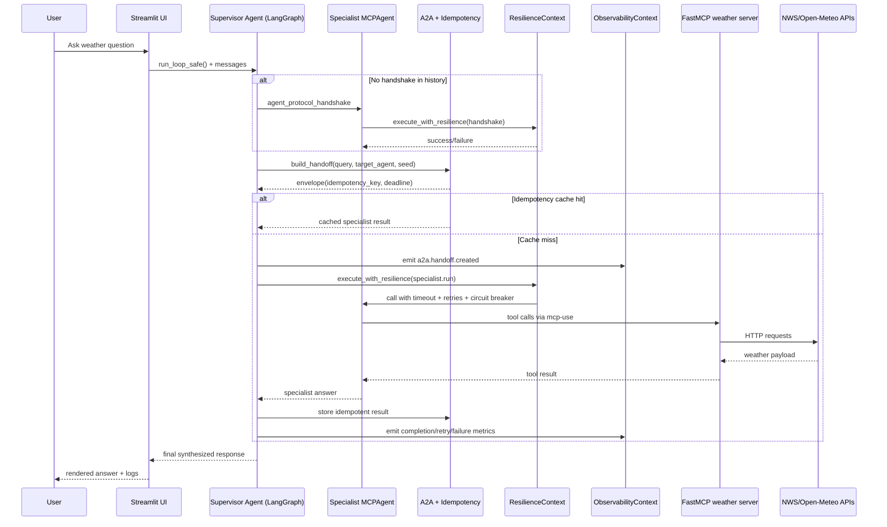
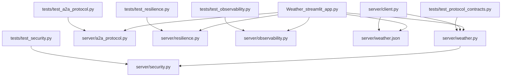

# MCP + A2A Weather: Complete Architecture Diagram and Implementation Inventory

This document maps the entire implemented architecture in this repository, including runtime flows, all implementation modules, and test coverage.

## 1) System-Level Architecture

## 2) Server-Side Implementation Architecture

## 3) Runtime Sequence (Supervisor -> Specialist -> MCP Tools)

## 4) Complete Implementation Inventory (All Implemented Modules)

### Root modules

- `main.py`
  - `main()`

- `Weather_streamlit_app.py`
  - Top-level setup:
    - Event loop policy for Windows
    - `nest_asyncio.apply()`
    - `load_dotenv()`
    - `st.set_page_config(...)`
    - session state keys: `messages`, `logs`, `a2a_idempotency_store`, `resilience_context`, `observability_context`
  - Functions:
    - `safe_image(path, caption=None, use_container_width=True)`
    - `add_log(message, type="info")`
    - `transcribe_audio(audio_bytes)`
    - `get_agent(model_name="llama-3.3-70b-versatile", callbacks=None)`
  - UI implementation:
    - Sidebar profile/project metadata
    - Five tabs: Project Demo, About Project, Tech Stack, Architecture, System Logs
    - Quick action grid (16 preset prompts)
    - Voice capture via `mic_recorder`
    - Chat export JSON/TXT, clear/reset controls
    - Graphviz architecture rendering
    - Real-time activity/system log panels and filters
  - Nested runtime classes/functions inside query execution path:
    - `UILogHandler(logging.Handler)` with `emit`
    - `UIStreamHandler(AsyncCallbackHandler)` with:
      - `__init__`
      - `on_llm_start`
      - `on_llm_new_token`
      - `on_llm_end`
    - `run_loop_safe()`
      - tool `ask_weather_specialist(query: str)`
        - `build_handoff(...)`
        - idempotency read/write
        - `ResilienceContext.get_breaker(...)`
        - callbacks: `on_retry_event`, `on_failure_event`
        - `execute_with_resilience(...)`
        - observability event emits for handoff/retry/completion/failure/circuit-breaker/error
      - tool `agent_protocol_handshake()`
        - handshake breaker and retry callbacks: `on_hs_retry`, `on_hs_failure`
        - specialist capability handshake call
      - LangGraph `create_react_agent` orchestration with system prompt

- `test_callback.py`
  - `MyAsyncHandler(AsyncCallbackHandler).on_llm_new_token(...)`
  - `test()` async demo

- `test_stream.py`
  - `test()` async demo for `agent.stream(...)`

- `test_stream_events.py`
  - `test()` async demo for `agent.stream_events(..., version="v2")`

### Server modules

- `server/weather.py`
  - Constants/config:
    - `NWS_API_BASE`, `USER_AGENT`, `SERVER_NAME`, `SERVER_VERSION`, `SCHEMA_VERSION`, `SUPPORTED_PROTOCOL_VERSIONS`
    - `TOOL_CONTRACTS`
    - `OPEN_METEO_GEO_URL`, `OPEN_METEO_API_URL`
  - Class:
    - `ProtocolError(Exception)` with `to_dict()`
  - Helper functions:
    - `_serialize_ok(data)`
    - `_serialize_error(error)`
    - `_enforce_policy(tool_name, agent_role="supervisor", region="US")`
    - `_validate_state(state)`
    - `_validate_city_name(city_name)`
    - `_coerce_coordinate(name, value, min_value, max_value)`
    - `_build_capabilities()`
    - `make_nws_request(url)`
    - `format_alert(feature)`
  - MCP tools/resources:
    - `get_capabilities()`
    - `negotiate_protocol(client_protocol_version)`
    - `get_alerts(state)`
    - `get_coordinates(city_name)`
    - `get_global_forecast(latitude, longitude)`
    - `echo_resource(message)` via `@mcp.resource("echo://{message}")`

- `server/a2a_protocol.py`
  - `A2AHandoffEnvelope` dataclass and methods:
    - `deadline_at`, `is_expired`, `remaining_seconds`, `to_dict`, `to_json`
  - `A2AIdempotencyStore` in-memory methods: `has`, `get`, `set`
  - `SQLiteA2AIdempotencyStore` methods:
    - `_connect`, `_ensure_schema`, `has`, `get`, `set`
  - `_make_idempotency_key(seed)`
  - `build_handoff(...)`

- `server/security.py`
  - `DenyReason` enum
  - `AgentIdentity` dataclass with `to_dict`
  - `PolicyDecision` dataclass with `to_dict`
  - `PolicyEngine`:
    - restrictions maps: `tool_role_restrictions`, `geographic_restrictions`
    - `sign_identity(identity)`
    - `verify_identity_signature(identity, signature)`
    - `evaluate_tool_access(tool_name, identity, intent_class="neutral", region="US")`
  - `SignedHandoffMetadata` dataclass with `to_dict`, `to_json`

- `server/resilience.py`
  - `CircuitState` enum
  - `RetryPolicy` dataclass with `backoff_duration(attempt)`
  - `CircuitBreakerConfig` dataclass
  - `CircuitBreakerMetrics` dataclass
  - `CircuitBreaker`:
    - `record_success`, `record_failure`, `can_execute`, `_transition_to`
  - `ResilienceContext`:
    - `get_breaker(name, config=None)`
    - `execute_with_resilience(call_name, coro_fn, timeout_s, on_retry, on_failure)`

- `server/observability.py`
  - `TraceContext` dataclass with `to_dict`
  - `StructuredEvent` dataclass with `to_json`
  - `LatencyBucket` with `record`, `to_dict`
  - `MetricsCollector`:
    - `increment_counter`, `set_gauge`, `record_latency`
    - `record_success`, `record_failure`, `record_retry`, `record_breaker_open`
    - `success_rate`, `to_dict`
  - `ObservabilityContext`:
    - `new_trace`, `new_span`
    - `emit_event`, `emit_log`
    - `get_event_log_json`, `get_metrics_json`

- `server/client.py`
  - `run_memory_chat()` async interactive CLI using MCPAgent with `memory_enabled=True`

### Test modules

- `tests/test_protocol_contracts.py`
  - `ProtocolContractTests(unittest.IsolatedAsyncioTestCase)`
  - Covers capability contract shape, protocol negotiation, parameter validation, and alert success formatting.

- `tests/test_a2a_protocol.py`
  - `A2AProtocolTests(unittest.TestCase)`
  - Covers handoff field population, deterministic idempotency keys, remaining deadline behavior, in-memory + SQLite store round-trips.

- `tests/test_security.py`
  - `AgentIdentityTests`
  - `PolicyEngineTests`
  - `SignedHandoffMetadataTests`
  - Covers signatures, role/geographic/intent policy decisions, unknown tool denial, metadata serialization.

- `tests/test_resilience.py`
  - `RetryPolicyTests`
  - `CircuitBreakerTests`
  - `ResilienceContextTests`
  - Covers backoff curve, breaker state transitions, timeout handling, retry callbacks, persistent failure behavior.

- `tests/test_observability.py`
  - `TestTraceContext`
  - `TestStructuredEvent`
  - `TestLatencyBucket`
  - `TestMetricsCollector`
  - `TestObservabilityContext`
  - `TestE2EObservabilityIntegration`
  - Covers trace/span generation, event serialization, histogram buckets, metrics aggregation, and cross-service trace correlation.

## 5) Configuration and Data Artifacts

- `server/weather.json`
  - MCP server launch config: runs `mcp run server/weather.py`

- `pyproject.toml`, `requirements.txt`
  - Python/package dependency manifest for Streamlit, MCP, LangChain, Groq, speech input, and async support.

- `assets/`
  - UI/architecture visual assets used by the Streamlit interface.

- `Weather result/`
  - Runtime persistence target for A2A idempotency SQLite DB.

- Documentation files:
  - `README.md`
  - `Project_Overview.md`
  - `PRODUCTION_ARCHITECTURE.md`
  - These document project intent, usage, and architecture progression.

## 6) Dependency Map (Implementation-Level)

## 7) Notes on Scope

This inventory includes all first-party implementation files present in the repository tree shown in the workspace context:

- root python modules
- all `server/*.py` implementation modules
- all `tests/*.py` automated tests
- root demo/test scripts (`test_callback.py`, `test_stream.py`, `test_stream_events.py`)
- configuration/data artifacts used at runtime (`server/weather.json`, `Weather result/`)
