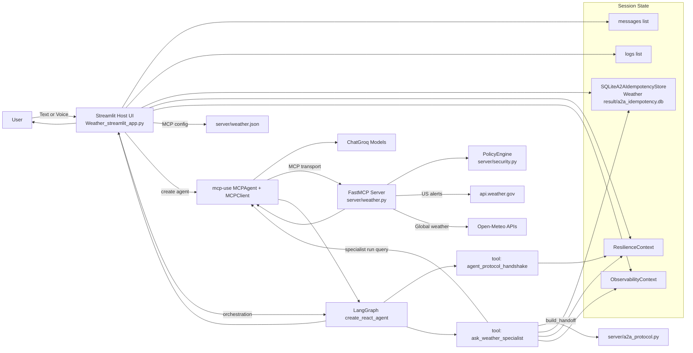
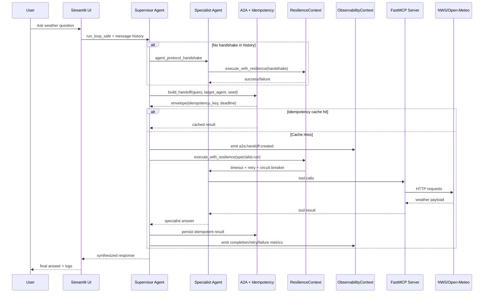
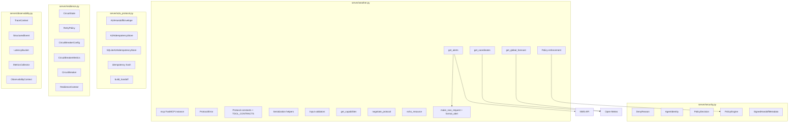
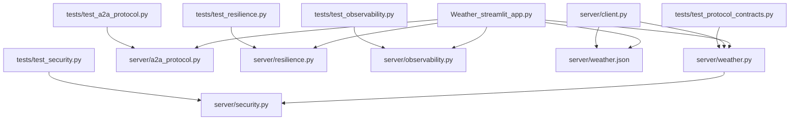

# MCP + A2A Weather Architecture (Presentation View)

## 1) End-to-End System View

```mermaid
flowchart LR
    U[User] -->|Text or Voice| ST[Streamlit Host UI\nWeather_streamlit_app.py]

    subgraph AppState[Session State]
      MSG[messages list]
      LOGS[logs list]
      IDEMP[SQLiteA2AIdempotencyStore\nWeather result/a2a_idempotency.db]
      RESCTX[ResilienceContext]
      OBSCTX[ObservabilityContext]
    end

    ST --> MSG
    ST --> LOGS
    ST --> IDEMP
    ST --> RESCTX
    ST --> OBSCTX

    ST -->|MCP config| CFG[server/weather.json]
    ST -->|create agent| MCPUSE[mcp-use MCPAgent + MCPClient]
    MCPUSE --> LLM[ChatGroq Models]

    ST -->|orchestration| LG[LangGraph create_react_agent]
    LG --> HS[tool: agent_protocol_handshake]
    LG --> AWS[tool: ask_weather_specialist]

    HS --> RESCTX
    AWS -->|build_handoff| A2A[server/a2a_protocol.py]
    AWS --> IDEMP
    AWS --> RESCTX
    AWS --> OBSCTX

    AWS -->|specialist run query| MCPUSE
    MCPUSE -->|MCP transport| WS[FastMCP Server\nserver/weather.py]
    WS --> SEC[PolicyEngine\nserver/security.py]
    WS -->|US alerts| NWS[api.weather.gov]
    WS -->|Global weather| OM[Open-Meteo APIs]

    WS --> MCPUSE --> LG --> ST --> U
```

## 2) Runtime Sequence View

```mermaid
sequenceDiagram
    participant User
    participant UI as Streamlit UI
    participant Sup as Supervisor Agent
    participant Spec as Specialist Agent
    participant A2A as A2A + Idempotency
    participant Res as ResilienceContext
    participant Obs as ObservabilityContext
    participant MCP as FastMCP Server
    participant Ext as NWS/Open-Meteo

    User->>UI: Ask weather question
    UI->>Sup: run_loop_safe + message history

    alt No handshake in history
      Sup->>Spec: agent_protocol_handshake
      Spec->>Res: execute_with_resilience(handshake)
      Res-->>Spec: success/failure
    end

    Sup->>A2A: build_handoff(query, target_agent, seed)
    A2A-->>Sup: envelope(idempotency_key, deadline)

    alt Idempotency cache hit
      A2A-->>Sup: cached result
    else Cache miss
      Sup->>Obs: emit a2a.handoff.created
      Sup->>Res: execute_with_resilience(specialist.run)
      Res->>Spec: timeout + retry + circuit breaker
      Spec->>MCP: tool calls
      MCP->>Ext: HTTP requests
      Ext-->>MCP: weather payload
      MCP-->>Spec: tool result
      Spec-->>Sup: specialist answer
      Sup->>A2A: persist idempotent result
      Sup->>Obs: emit completion/retry/failure metrics
    end

    Sup-->>UI: synthesized response
    UI-->>User: final answer + logs
```

## 3) Server Module View

```mermaid
flowchart TB
    subgraph WeatherServer[server/weather.py]
      W0[mcp FastMCP instance]
      W1[ProtocolError]
      W2[Protocol constants + TOOL_CONTRACTS]
      W3[Serialization helpers]
      W4[Input validators]
      W5[Policy enforcement]
      W6[get_capabilities]
      W7[negotiate_protocol]
      W8[get_alerts]
      W9[get_coordinates]
      W10[get_global_forecast]
      W11[echo_resource]
      W12[make_nws_request + format_alert]
    end

    subgraph Security[server/security.py]
      S1[DenyReason]
      S2[AgentIdentity]
      S3[PolicyDecision]
      S4[PolicyEngine]
      S5[SignedHandoffMetadata]
    end

    subgraph A2A[server/a2a_protocol.py]
      A1[A2AHandoffEnvelope]
      A2[A2AIdempotencyStore]
      A3[SQLiteA2AIdempotencyStore]
      A4[idempotency hash]
      A5[build_handoff]
    end

    subgraph Resilience[server/resilience.py]
      R1[CircuitState]
      R2[RetryPolicy]
      R3[CircuitBreakerConfig]
      R4[CircuitBreakerMetrics]
      R5[CircuitBreaker]
      R6[ResilienceContext]
    end

    subgraph Observability[server/observability.py]
      O1[TraceContext]
      O2[StructuredEvent]
      O3[LatencyBucket]
      O4[MetricsCollector]
      O5[ObservabilityContext]
    end

    W5 --> S4
    W8 --> W12
    W8 --> NWS[NWS API]
    W9 --> OM[Open-Meteo]
    W10 --> OM
```

## 4) Implementation Dependency View

```mermaid
flowchart TD
    WA[Weather_streamlit_app.py]
    W[server/weather.py]
    A2A[server/a2a_protocol.py]
    SEC[server/security.py]
    RES[server/resilience.py]
    OBS[server/observability.py]
    CL[server/client.py]
    CFG[server/weather.json]

    WA --> A2A
    WA --> RES
    WA --> OBS
    WA --> CFG
    WA --> W

    W --> SEC
    CL --> CFG
    CL --> W

    T1[tests/test_protocol_contracts.py] --> W
    T2[tests/test_a2a_protocol.py] --> A2A
    T3[tests/test_security.py] --> SEC
    T4[tests/test_resilience.py] --> RES
    T5[tests/test_observability.py] --> OBS
```
