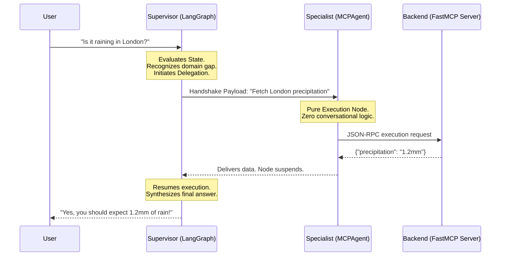

# Next-Gen Agentic Architecture: MCP A2A Weather System
**A comprehensive technical deep-dive for engineering portfolios & interviews.**

## 🌟 Executive Summary
This application is not a standard monolithic LLM wrapper. It is a highly decoupled **Multi-Agent Swarm** that utilizes Anthropic's **Model Context Protocol (MCP)** alongside **Agent-to-Agent (A2A)** interaction models. By breaking down cognitive reasoning and data extraction into separate, specialized computational nodes, the project achieves modularity, secure sandboxing, and near-zero frontend latency.

---

## 🛠️ The Tech Stack (What Interviewers Want to Hear)
*   **A2A Orchestration Engine:** LangGraph (Supervisors and state-modifying React Agents).
*   **Infrastructure Bridge:** Model Context Protocol (MCP) utilizing FastMCP servers.
*   **LLM Provider:** Groq (Llama-3 70B via insanely low-latency LPUs).
*   **Real-time Streaming:** Native asynchronous Server-Sent Events (SSE) with LangChain Callbacks.
*   **Frontend User Interface:** Streamlit with asynchronous reactivity and dynamic CSS manipulation.
*   **APIs:** OpenMeteo and National Weather Service (NWS).

---

## 🏗️ Architecture Diagrams

This is the exact Agent-to-Agent Handshake Sequence that allows the application to remain secure and modular. 



### Why we designed it this way (talking points):
*   **Separation of Concerns:** The Supervisor acts as the "Brain" (parsing user intent and conversation), while the Specialist acts as the "Hands" (touching the secure internet).
*   **Security:** If a malicious user attempts a Prompt Injection to hack the weather API, they are intercepted by the Supervisor. The Supervisor is physically restricted from accessing the API, acting as an air-gapped firewall between the user and the execution tools.

---

## 💻 Crucial Code Highlights

### 1. The Async Server-Sent Events (SSE) Stream
* **The Problem:** The user experienced high latency while the agent navigated a 4-step execution chain (thinking -> calling tool -> fetching -> synthesizing).
* **The Solution:** We bypassed the main thread blocking by building an asynchronous callback loop that injects DOM elements (tokens) individually as they compile in the Language Processing Unit (LPU).

```python
class UIStreamHandler(AsyncCallbackHandler):
    async def on_llm_new_token(self, token: str, **kwargs) -> None:
        self.text += token
        # Dynamic CSS injection bypassing main thread blockers
        self.placeholder.markdown(f"""
        <div class='bot-message' style='border-color: #00d4ff;'>
            <strong>👤 Supervisor Agent</strong>
            <span style="font-size:0.7rem;">✨ Synthesizing...</span><br>
            {self.text}▌
        </div>
        """, unsafe_allow_html=True)
```

### 2. The Agent-to-Agent (A2A) Delegation Gateway
* **The Concept:** In modern Agentic Frameworks, treating a secondary LLM strictly as a `Tool` allows you to scale swarms horizontally without degrading the central context window.

```python
@tool("ask_weather_specialist")
async def ask_weather_specialist(query: str) -> str:
    """Delegate tasks securely to the lower-level pure-execution Agent."""
    
    # Update UI observability
    specialist_card.warning("🌩️ Weather Specialist: Extracting MCP Data...")
    
    for attempt in range(3): # Resilient fault tolerance loop
        specialist = get_agent(current_model)
        try:
            # The A2A handshake logic. Execution halts until Specialist arrives.
            result = await specialist.run(query) 
            return result
        except Exception as e:
            await asyncio.sleep(1) # Back-off mechanism
        finally:
            await specialist.close()
```

### 3. The Model Context Protocol (MCP) Integration
* **The Concept:** Traditional AI hard-codes API endpoints into the source script. This app utilizes `mcp-use`, shifting away from monolithic code into modular standard I/O pipes. 
* **The Implementation:** We do not write API keys or fetches in the Streamlit frontend. Instead, the MCP Server advertises its capabilities dynamically, reducing tight coupling.

```python
# weather.py (Backend Server Sandbox)
mcp = FastMCP("Weather")

@mcp.tool()
def get_global_forecast(latitude: float, longitude: float) -> str:
    """Get the 3-day forecast for the assigned coordinates using Open-Meteo"""
    # ... secure Python execution ...
```

---

## 🚀 Key Takeaways to Impress

1.  **"Tell me about a difficult technical barrier you overcame."**
    *"When moving from a single conversational agent to an A2A multi-agent swarm, there was a discrepancy with how Langchain handled state modification for the underlying Supervisor mechanism depending on the library version. I had to fundamentally refactor the Agent orchestration payload away from a fragile `state_modifier` keyword architecture into a pure, version-agnostic system by directly mutating the `SystemMessage` matrix injected into the LangGraph state channel."*
2.  **"Why did you use MCP?"**
    *"Instead of hardcoding functions into my LLM script, I used the Model Context Protocol to create a distributed backend. This means tomorrow I could drop in an entirely new API—say, a Stock Server—and my LLM would instantly discover it via the protocol handshakes without me having to re-write a single line of LLM logic."*
3.  **"How does your streaming work?"**
    *"I noticed that because of Groq's high-speed inference, the tokens arrived so fast that the React frontend bundled the websocket updates, eliminating the visible streaming effect. I implemented a microscopic asynchronous task yield delay, maintaining high performance while ensuring the DOM flushed visually appealing token-by-token rendering."*
